# Umbra Studio

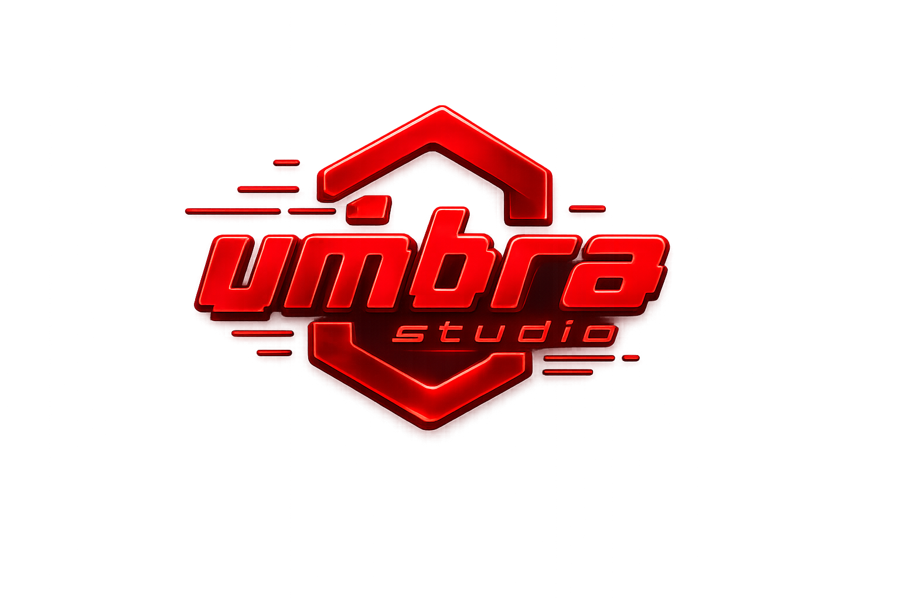

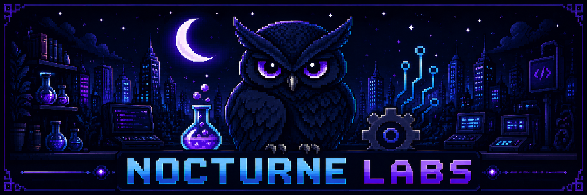

**An original Nocturne AI Labs project, developed by Minokai.**

Umbra Studio is a desktop-first AI art and workflow application built to unify
generation backends, prompt tooling, media browsing, metadata handling, model
management, and portable tool orchestration inside one app-managed environment.

## Before You Install

For most users, the recommended path is a portable release package. Extract it,
run the platform launcher, then install the tools and models needed for the
features you plan to use. A portable release does not require a global Bun or
Python installation for Umbra itself.

See [REQUIREMENTS.md](REQUIREMENTS.md) for the supported platforms, recommended
hardware, Linux packages, ports, per-feature dependencies, caption-model pack,
and links to every managed upstream tool.

See [CHANGELOG.md](CHANGELOG.md) for release highlights and instructions for
migrating existing `User/` and `Tools/` folders into a new portable version.

Quick summary:

- Windows 10/11 x64 is the primary platform; Linux x64 portable builds are supported.
- Git and internet access are required to install or update managed tools.
- An NVIDIA GPU with current drivers is the best-supported generation/training path.
- Generation checkpoints, LoRAs, VAEs, text encoders, and video models are supplied by the user.
- AI Toolkit currently requires host Node.js 20 or newer for its upstream web UI.
- Umbra Remote requires the user's own Tailscale account and private tailnet.

## Feature Highlights

- Gallery and Filmstrip for output browsing, viewing, and organization
- Power Prompter for prompt construction, grouped queues, and tracked batch workflows
- Metadata Scanner for prompt recovery, metadata parsing, and tag workflows
- Model Manager for local model organization and snapshot-based CivitAI import
- Data Forge for dataset collection and curation workflows
- Umbra UI for model-aware image, video, img2img, inpaint, and upscale pipelines
- Managed tool runtime support for ComfyUI and AI Toolkit
- Local Servers for opening localhost/LAN tools inside Umbra

## Interface Tour

The screenshots below use safe demonstration media and omit the embedded
ComfyUI workspace. Select an image to open the full-size view.

See the [Umbra UI Tour](UMBRA_UI_TOUR.md) for a guided walkthrough of the shared
model-aware pipeline, TXT2IMG, IMG2IMG, Inpaint, Video, Extras, and the Power
Prompter handoff.

| Umbra UI TXT2IMG | Umbra UI Inpaint |
| --- | --- |
| [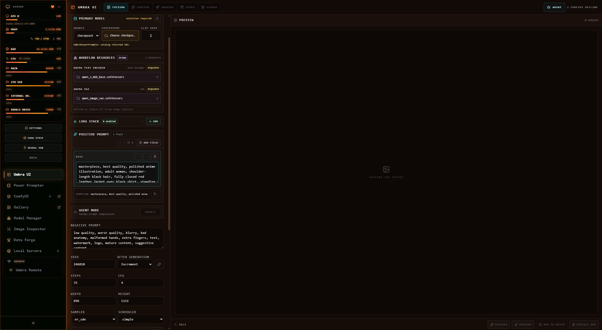](.github/screenshots/umbra-ui-txt2img.png) | [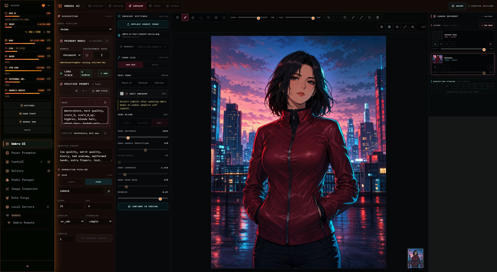](.github/screenshots/umbra-ui-inpaint.png) |

| Power Prompter Editor | Queue Manager |
| --- | --- |
| [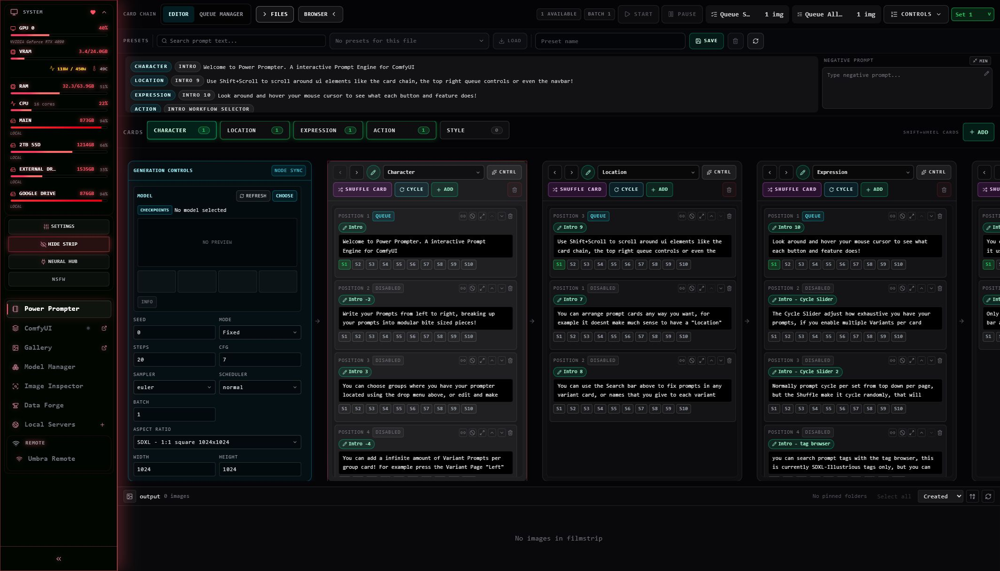](.github/screenshots/power-prompter-editor.png) | [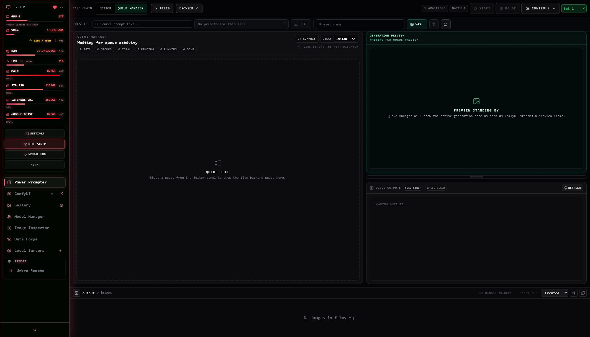](.github/screenshots/power-prompter-queue-manager.png) |

| Gallery | Data Forge |
| --- | --- |
| [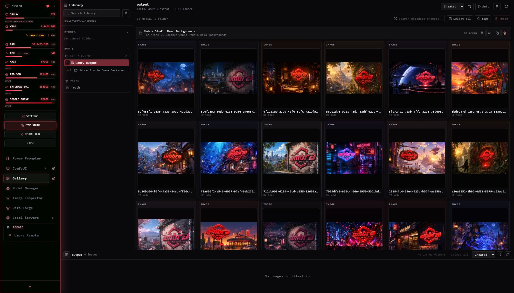](.github/screenshots/gallery.png) | [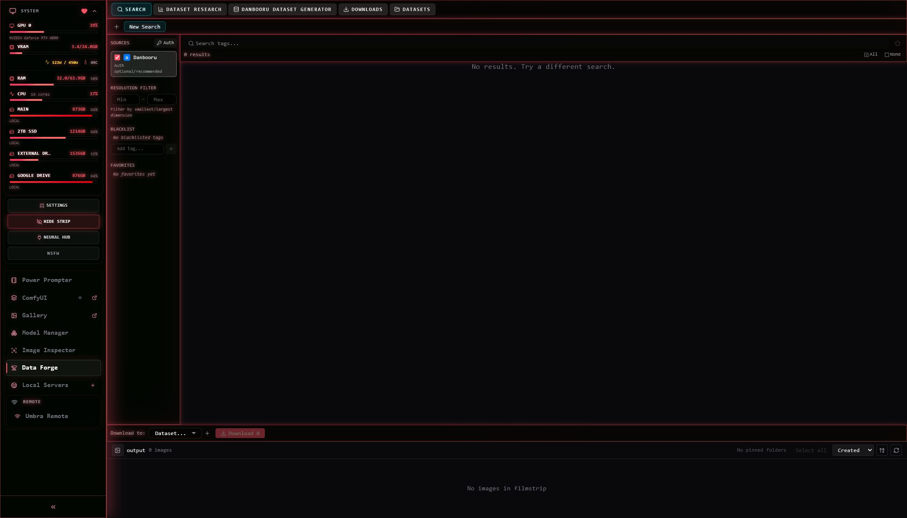](.github/screenshots/data-forge.png) |

| Local Servers | Model Manager |
| --- | --- |
| [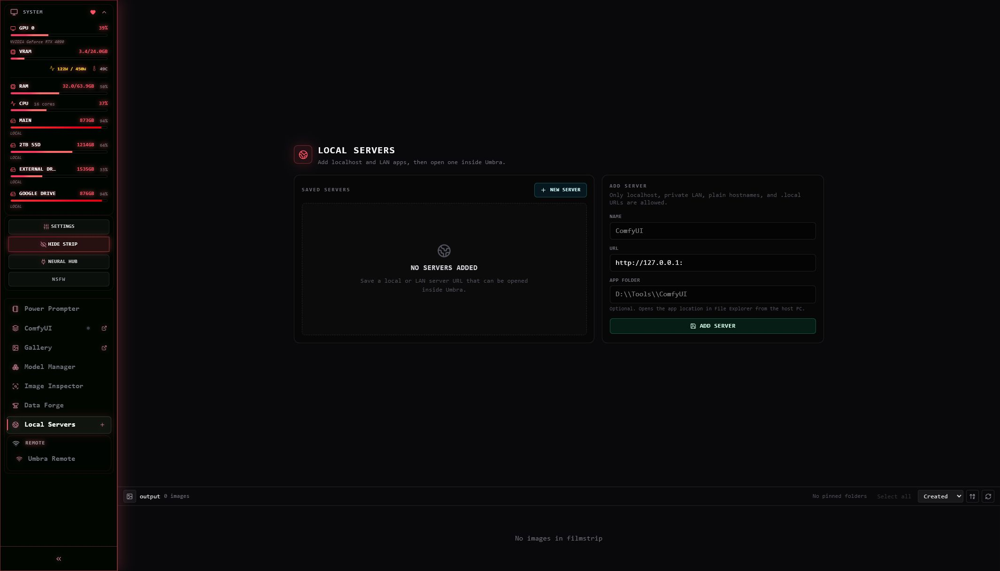](.github/screenshots/local-servers.png) | [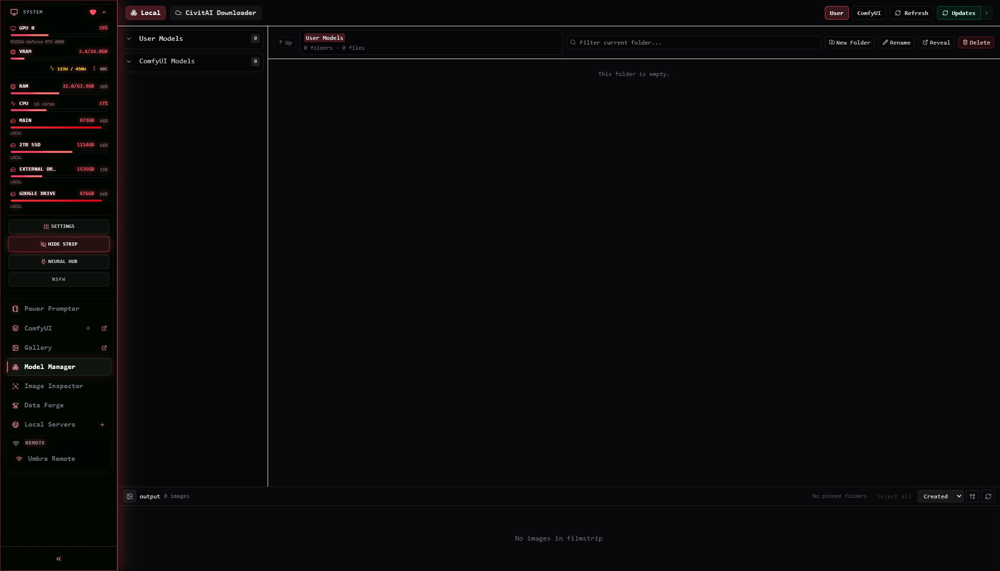](.github/screenshots/model-manager.png) |

| Image Inspector | Theme Studio |
| --- | --- |
| [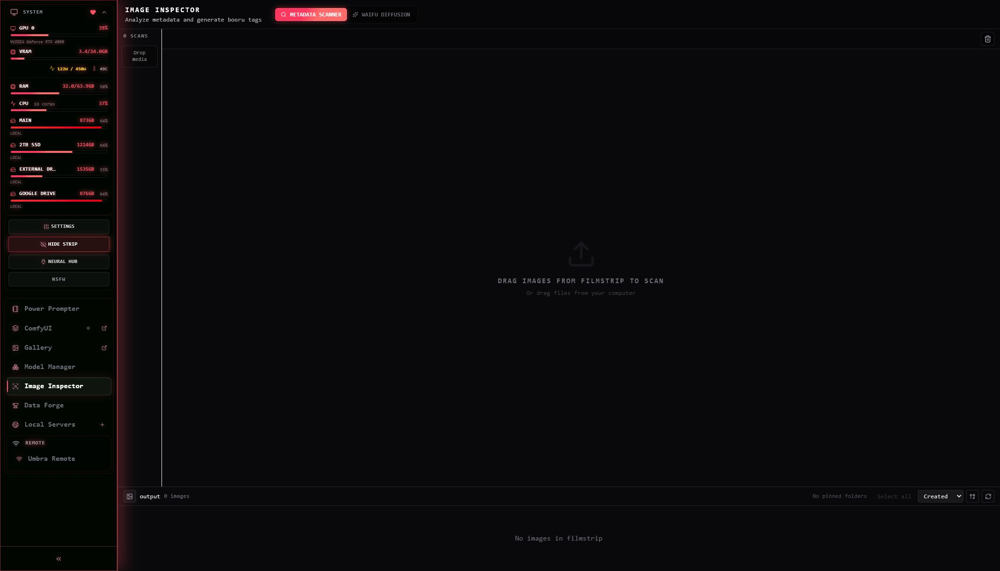](.github/screenshots/image-inspector.png) | [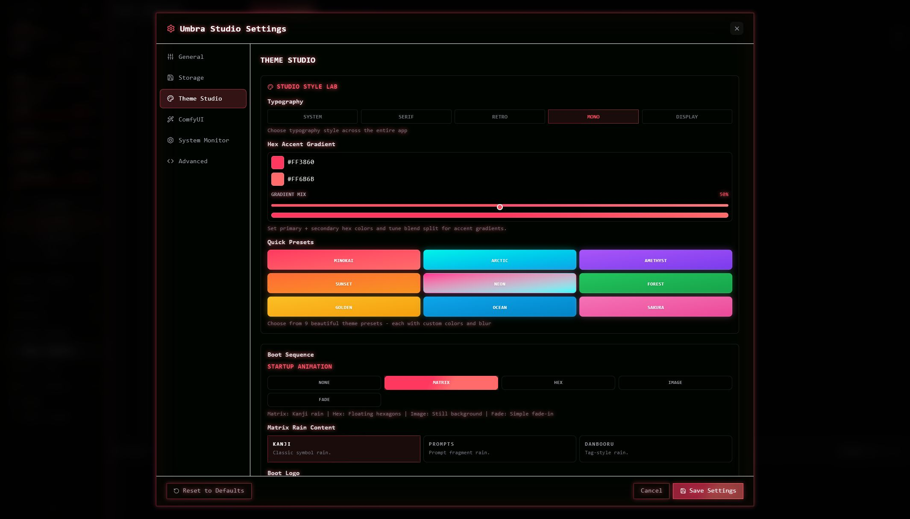](.github/screenshots/theme-studio.png) |

## User Release Model

Normal users should download a portable release zip, extract it, and run
`UmbraStudio.exe`. They should not need to clone the repository or install Bun.

The portable app bundles the Bun runtime under:

```text
Runtime/Bun/<platform>/
```

Managed tools and optional model packs are installed from inside Umbra or with the
release's helper scripts. GPU drivers and compatible generation model files remain
the user's responsibility.

When a managed Python tool is installed, Umbra can bootstrap its private Python
3.11 runtime into `Runtime/Python311`; users do not need to place Python inside
the application folder manually. The initial GitHub core archive keeps that
download out of the release asset and creates it on demand.

### First Run: Data Forge Caption Models

Data Forge uses a separate caption-model pack of more than 6 GB. Full portable
builds may already include it. GitHub core packages keep these weights out of
the main download; after extracting Umbra Studio, install them from the app
folder with the helper for your platform:

Windows:

```bat
Install-Data-Forge-Models.bat
```

Linux:

```bash
chmod +x install-data-forge-models.sh
./install-data-forge-models.sh
```

Keep the terminal open until it reports `Data Forge models are ready.` The
installer resumes partial downloads, verifies every pinned file, and places the
models under:

```text
User/Models/WaifuTagger/
User/Models/DataForgeCaption/
```

Users running directly from a repository checkout can install the same pinned
model pack with:

```bash
bun run models:waifu:download
bun run models:caption:download
```

Restart Umbra after installation if Data Forge was already open. Arbitrary
caption models are not currently auto-discovered; manually supplied files must
match one of the supported model folders and file layouts in
`defaults/DataForge/model-manifest.json`.

AI Toolkit is optional and currently requires Git plus Node.js 20 or newer for
its upstream web UI build. Umbra manages its checkout and Python virtual
environment after those host prerequisites are available.

Linux managed-tool installs also require the standard Python build headers and
compiler toolchain because some ComfyUI custom-node dependencies do not publish
wheels for every Python/platform combination. On Debian or Ubuntu, install them
with `sudo apt install python3-dev build-essential libgl1 libglib2.0-0`.

Data Forge includes two captioning paths: four pinned SmilingWolf WD Tagger v3
ONNX models for structured booru tags, and a pinned Qwen2-VL 2B caption model
for natural-language captions. Local portable builds bundle this model pack by
default. Repository checkouts and GitHub core packages keep the model weights
out of Git and install exact revisions from
`defaults/DataForge/model-manifest.json` using the steps above.

Python helpers use virtual environments:

- Managed tools such as ComfyUI use tool-local venvs, for example `Tools/ComfyUI/venv/`.
- Umbra helper scripts such as WD tagger use `Runtime/PythonHelpers/venv/`.

## Development Quick Start

Prerequisites for source development:

- Bun
- Git
- Python for ComfyUI/tool runtimes
- Linux: Python development headers and a C/C++ compiler toolchain
- GPU drivers and model files for local generation workflows

From a source checkout:

```powershell
cd umbra-studio
```

Install source dependencies:

```powershell
bun install
```

Run the normal full development server:

```powershell
bun run dev:fullstack
```

Open:

```text
http://localhost:8212
```

Useful development commands:

```powershell
bun run dev:backend
bun run build:frontend
bun run webapp:dev
```

`dev:fullstack` is the preferred day-to-day command. `webapp:dev` runs through
the portable web launcher path and is useful when testing launcher/runtime
behavior.

## Tool Install / Update Entry Points

Linux/macOS:

```bash
./install-tools.sh all
```

Windows:

```bat
install-tools.bat all
```

Single-tool examples:

```bash
./install-tools.sh comfyui
./install-tools.sh comfy-nodes
./install-tools.sh python-helpers
```

AI Toolkit and ComfyUI are managed installations stored under `Tools/`; their
large upstream checkouts and virtual environments are not committed to this
repository. Data Forge model weights are pinned by the included downloader
scripts. GitHub portable packages include `Install-Data-Forge-Models.bat` or
`install-data-forge-models.sh` so users can install those weights after
extracting the core package. Downloads are checked against the byte sizes and
SHA-256 values in the bundled manifest before installation completes.

## Publish Portable Build

Before publishing, confirm the target publish folder and whether the build is a
no-bump update or a version-bump release. See `PUBLISHING.md` for the full
agent/developer publishing flow.

Future agents should not publish until the user confirms:

- target platform
- target publish folder
- no-bump update or version-bump release

GitHub releases are built by `.github/workflows/release.yml`. See
`PUBLISHING.md` for the clean-source command, model packaging policy, and the
full Windows/Linux validation matrix.

Windows portable folder builds:

No-bump update of the current version folder:

```powershell
bun run webapp:update-folder:no-bump
```

Versioned publish:

```powershell
bun run webapp:update-folder
```

Linux portable folder builds:

```bash
bun run linux:update-folder:no-bump
bun run linux:update-folder
```

Default local output in the current Windows development scripts:

```text
../Apps/Umbra Studio/v<version>/
```

## Runtime Paths

Portable builds keep runtime data next to the app version folder:

```text
Umbra Studio/v<version>/
```

Important runtime folders:

- `Tools`
- `User`

The clean repository keeps an empty `Tools/` folder and a placeholder-only
`User/` directory tree so developers can see the runtime layout immediately.
Installed tools, model weights, configuration, datasets, and generated media
remain untracked. The old top-level `Models/` path is not used; Umbra-owned
models live under `User/Models`, while ComfyUI owns `Tools/ComfyUI/models`.

Do not wipe existing version folders during publishing, updating, or cleanup.
They can contain model merges, generated outputs, installed tools, and other
runtime artifacts that are not recoverable from the source tree.

Root shortcuts are created there:

- `ComfyUI-Models`
- `ComfyUI-Output`
- `ComfyUI-Nodes`

Tools are intentionally **not** stored in `resources/app`.

## Documentation

- System and feature requirements: `REQUIREMENTS.md`
- Publishing guide for agents/developers: `PUBLISHING.md`
- Root distributable credits: `Credits.md`
- License: `LICENSE`
- Attribution notice for public forks / redistributed builds: `NOTICE`

Internal planning and agent notes are deliberately excluded from the public
source package. User-facing help is maintained inside Umbra Studio.

## Ownership

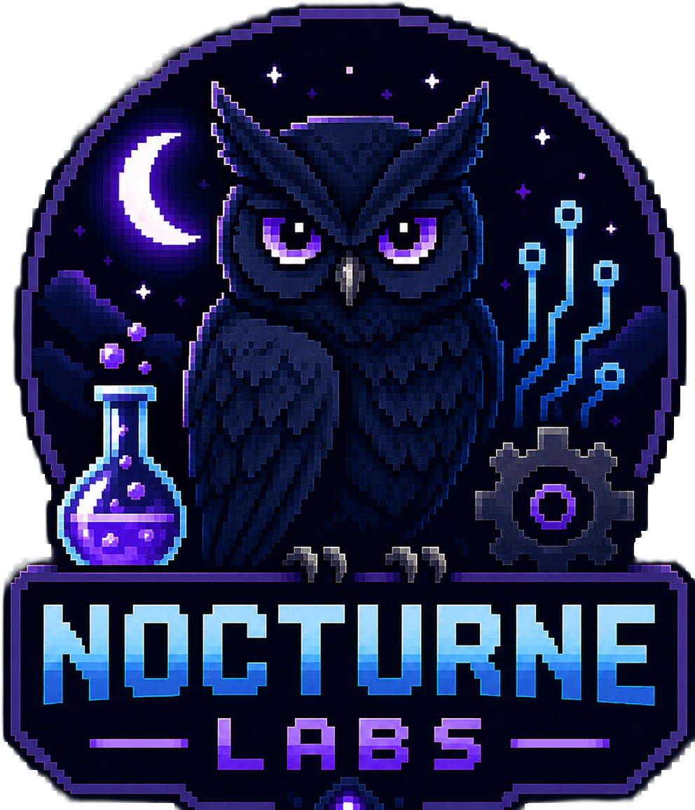

Umbra Studio is owned and published by **Nocturne AI Labs** and developed by
**Minokai**. The canonical repository is
[Nocturne-Ai-Labs/Umbra-Studio](https://github.com/Nocturne-Ai-Labs/Umbra-Studio).
