# Umbra Studio

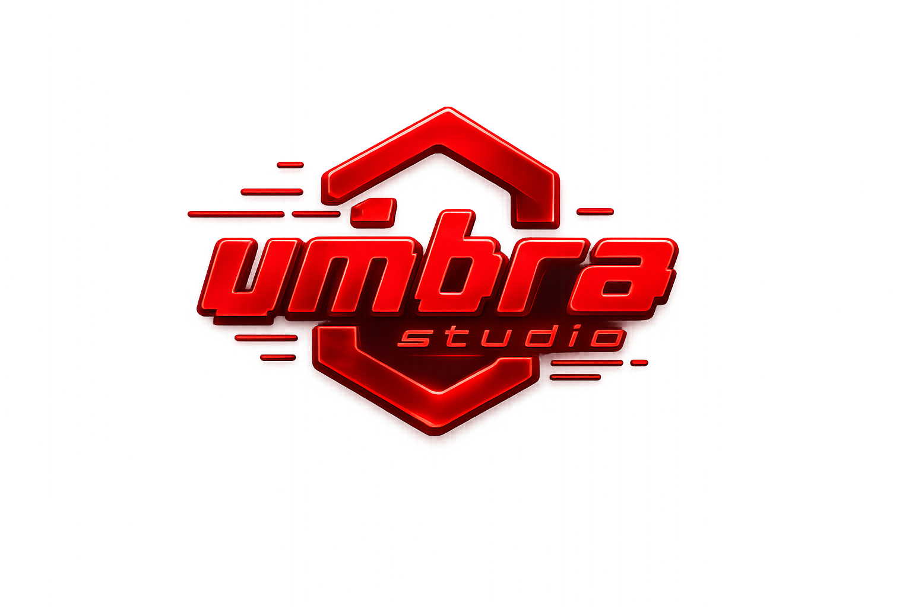

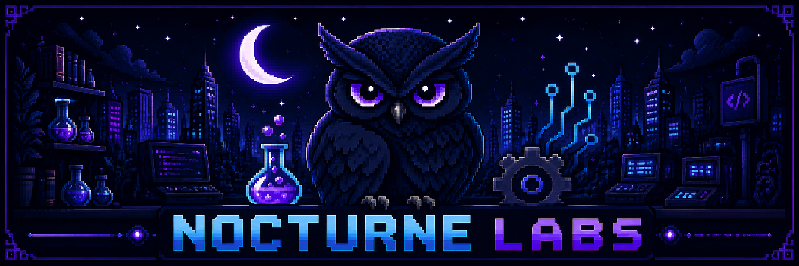

**An original Nocturne AI Labs project, developed by Minokai.**

[](https://ko-fi.com/G2G11SL0X3)

Umbra Studio is a desktop-first AI art and workflow application built to unify
generation backends, prompt tooling, media browsing, metadata handling, model
management, and portable tool orchestration inside one app-managed environment.

Umbra Studio has entered **Beta**, beginning with **0.90.0-beta**. Development
will continue through Beta before 1.0; this milestone does not remove the
experimental status of Mobile, Canvas, or video generation. See the current
release notes for feature-specific limitations and setup requirements.

## Built With

- [Bun](https://bun.sh/) powers Umbra's TypeScript backend, local HTTP and
  WebSocket services, portable runtime, and build tooling.
- [React](https://react.dev/) and [TypeScript](https://www.typescriptlang.org/)
  power the frontend workspaces and shared component system.
- [Python](https://www.python.org/) powers managed AI runtimes and helper
  environments used by ComfyUI, AI Toolkit, dataset tagging, and captioning.
- [Tailwind CSS](https://tailwindcss.com/) supports the frontend styling system.

Portable releases bundle Umbra's Bun runtime and can bootstrap isolated Python
environments for managed tools, so normal users do not need global Bun or
Python installations just to launch the app.

## Before You Install

For most users, the recommended path is a portable release package. Extract it,
run the platform launcher, then install the tools and models needed for the
features you plan to use. A portable release does not require a global Bun or
Python installation for Umbra itself.

See [REQUIREMENTS.md](REQUIREMENTS.md) for the supported platforms, recommended
hardware, Linux packages, ports, per-feature dependencies, caption-model pack,
and links to every managed upstream tool.

See [CHANGELOG.md](CHANGELOG.md) for release highlights. Portable builds include
**Umbra Setup**, which combines guided onboarding, managed-tool maintenance,
model downloads, and application updates. Setup does not block normal Umbra startup.

The version button at the bottom-left opens **Setup > Updates**. `(+x)` reports
newer compatible GitHub releases. Save your work before opening it from Umbra:
the main app and its managed tools close cleanly. Select a release, follow the
download and installation progress, then use **Launch Umbra Studio** when the
update finishes. Updates preserve `User/` and `Tools/`. Downloads, rollback
backups, and logs use the root-local `User/Cache/UmbraUpdater` workspace.
`UmbraUpdater.bat` and `umbra-updater.sh` remain compatibility shortcuts to the
same app’s Updates tab. An existing Setup session is reused.

Quick summary:

- Windows 10/11 x64 is the primary platform; Linux x64 portable builds are supported.
- Git and internet access are required to install or update managed tools.
- Generation and training in current portable releases require an NVIDIA GPU with
  current drivers. AMD and Intel GPU acceleration are not supported yet.
- Generation checkpoints, LoRAs, VAEs, text encoders, and video models are supplied by the user.
- AI Toolkit currently requires host Node.js 20 or newer for its upstream web UI.
- Umbra Remote requires the user's own Tailscale account and private tailnet.

Umbra Studio is open source. Forks or contributions that establish reliable AMD
or Intel GPU support are welcome, but those platforms are not supported by the
current releases.

## Feature Highlights

- Gallery and Filmstrip for output browsing, viewing, and organization
- Power Prompter for prompt construction, grouped queues, and tracked batch workflows
- Metadata Scanner for prompt recovery, metadata parsing, and tag workflows
- Model Manager for local model organization and snapshot-based CivitAI import
- Data Forge for dataset collection and curation workflows
- Umbra UI for model-aware image, video, img2img, inpaint, and upscale pipelines
- Experimental Canvas for desktop/tablet layer editing, masks, saved projects, restore points, and portable project export
- Optional LTX 2.3 Storyboard mode for timed per-shot prompts, multiple guide images, and selective agent prompt enhancement
- Managed tool runtime support for ComfyUI and AI Toolkit
- Local Servers for opening localhost/LAN tools inside Umbra

## Interface Tour

### Official H3 and LTX video workflows

Video defaults to **DaSiWa only**, using the bundled, pinned originals
**MiniMax H3 MythicAlchemy C-MMH3-26** and **LTX OmniForge C-LTX23-50**.
The original files and their GPL provenance are under
[`defaults/PowerPrompter/Official Workflows/DaSiWa`](defaults/PowerPrompter/Official%20Workflows/DaSiWa/PROVENANCE.md).
Umbra does not substitute an adapted graph when an official workflow is held.

1. Review the workflow dependency repair in Umbra Setup > Tools. It
   uses the existing managed installer for compatible ComfyUI/frontend and node
   suites. Finish queued work and stop managed ComfyUI before repair. Conflicting
   local edits are retained and reported. Models are a separate selection/setup
   step; dependency repair does not download generation weights.
2. Start managed ComfyUI normally and refresh its frontend. In Umbra Video,
   select the official workflow and **Check readiness**, then **Load official
   workflow in ComfyUI**. Resolve missing nodes, models or frontend errors before
   continuing. LTX's original TritonVAE option needs a compatible Triton runtime
   when enabled; it does not make Triton an H3 requirement.
3. Set prompt, installed models, duration and fixed seed through the original
   native controls without editing wiring. Use **Capture from ComfyUI**.
   Alternatively, export both **Workflow JSON** and **API JSON** from the same
   configured native graph, then choose them under **Import native exports**.
   Export again after any change. Each file must be at most 16 MiB; unsafe numeric
   seeds are held rather than rounded. Decimal seed strings are retained.
4. Review the captured prompt and queue one snapshot through **Queue captured
   workflow**. Capture/import does not itself submit a job. Readiness is checked
   again before submission. Missing resources or changed runtime identity hold
   the work until reviewed; there is no automatic retry after an uncertain POST.

The native serializer remains responsible for virtual nodes, status switches and
subgraph expansion. Import checks source topology, execution IDs/classes, direct
executable connections, runtime schemas and retained export hashes. A manual
export pair is supplied by the host user; these checks do not prove that a browser
produced it or qualify GPU execution. A real native export and generation test
are still required to establish runtime compatibility and output quality.

**All video routes** is the explicit legacy route choice. Switching policies saves
the latest controls and device prompt first and pauses affected queue work until
an explicit Resume. Existing adapter modules, settings, drafts, captures and
history remain available. This route choice is separate from restoring an app
source/build backup; app rollback does not silently downgrade Python packages or
custom node suites.

For a temporary Windows development test against an existing local ComfyUI
process, `scripts/prepare-official-comfy-session.ts` can produce a fresh, read-only
binding with `--base-url`, `--tool-root` and `--runtime-root`. The runtime root must
already exist outside both source and the personal installation. Set
`UMBRA_OFFICIAL_COMFY_SESSION` to its JSON and `UMBRA_ROOT` to that isolated folder
only in the test process, with separate Umbra/Comfy ports. The binding expires
after 30 minutes and accepts one official queue submission. PID, creation time,
listener and physical roots are rechecked; tool changes, lifecycle controls,
direct Comfy writes and broad interrupt/clear are held. No setting is persisted.

The screenshots below use safe demonstration media and omit the embedded
ComfyUI workspace. Select an image to open the full-size view.

See the [Umbra UI Tour](UMBRA_UI_TOUR.md) for a guided walkthrough of the shared
model-aware pipeline, TXT2IMG, IMG2IMG, Inpaint, Canvas, Video, Extras, and the Power
Prompter handoff.

| Umbra UI TXT2IMG | Umbra UI Inpaint |
| --- | --- |
| [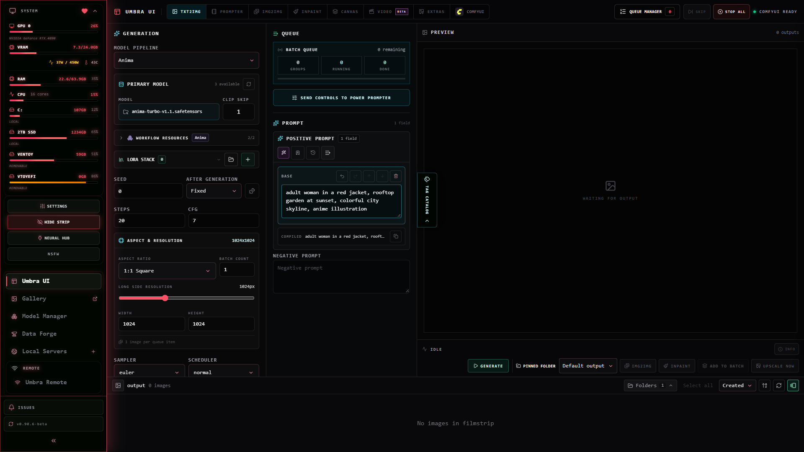](.github/screenshots/umbra-ui-txt2img.png) | [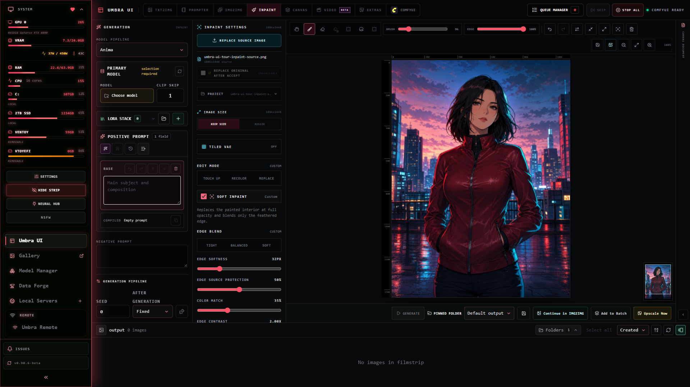](.github/screenshots/umbra-ui-inpaint.png) |

| Power Prompter Editor | Queue Manager |
| --- | --- |
| [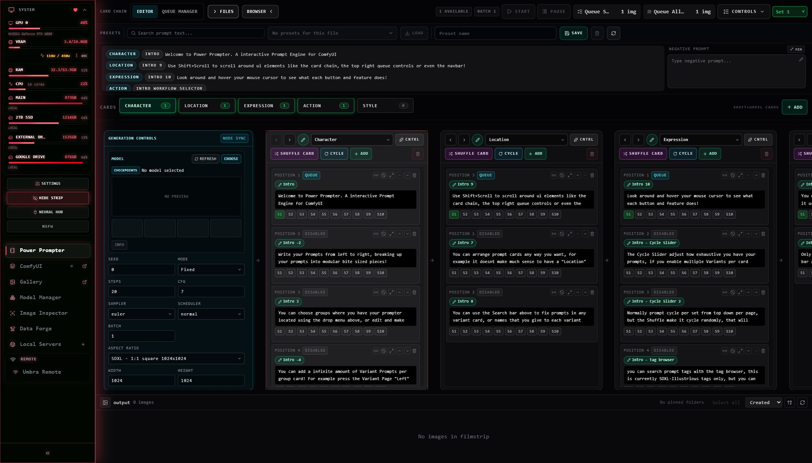](.github/screenshots/power-prompter-editor.png) | [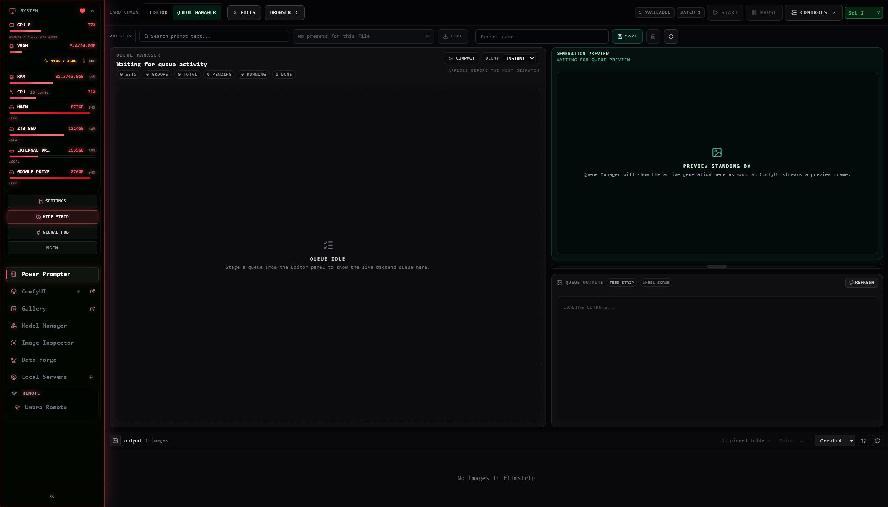](.github/screenshots/power-prompter-queue-manager.png) |

| Gallery | Data Forge |
| --- | --- |
| [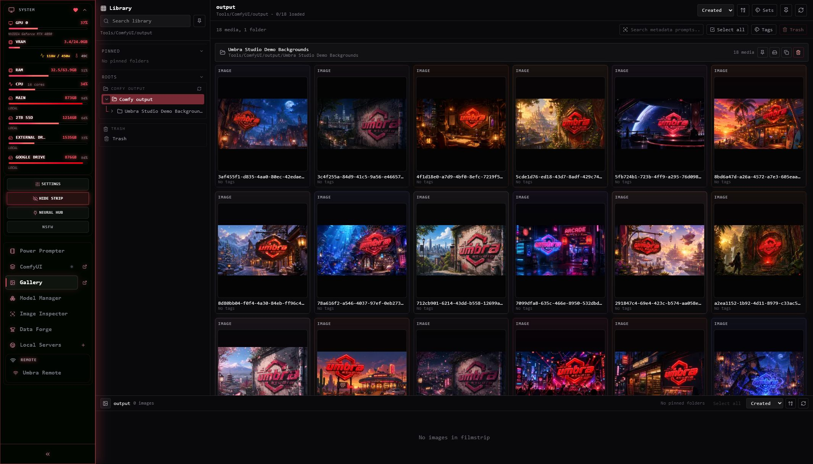](.github/screenshots/gallery.png) | [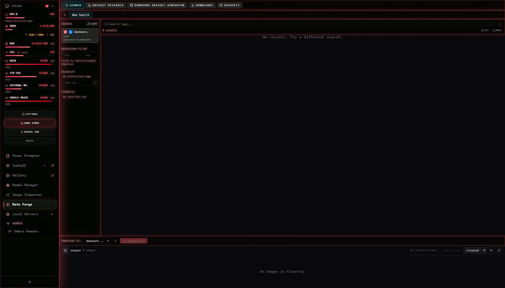](.github/screenshots/data-forge.png) |

| Local Servers | Model Manager |
| --- | --- |
| [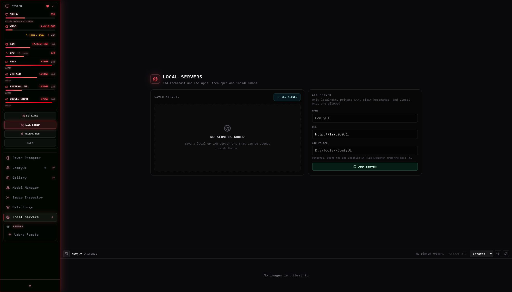](.github/screenshots/local-servers.png) | [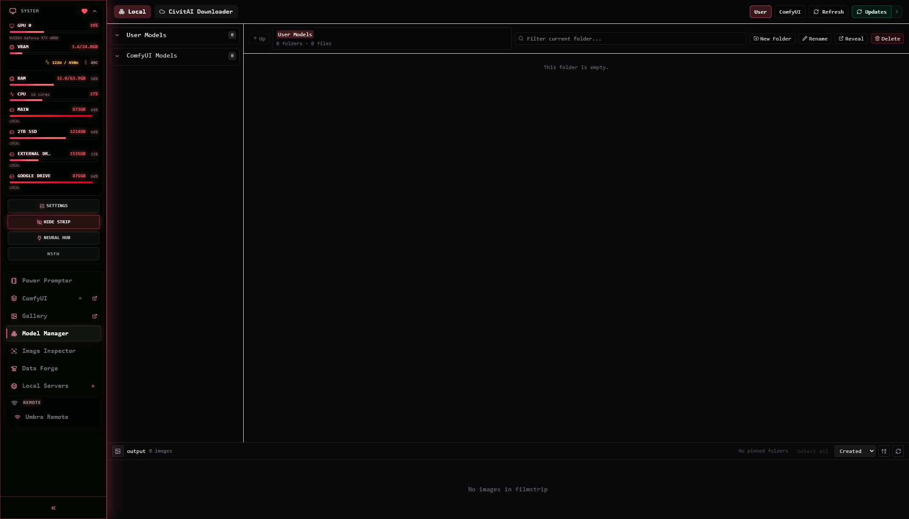](.github/screenshots/model-manager.png) |

| Image Inspector | Theme Studio |
| --- | --- |
| [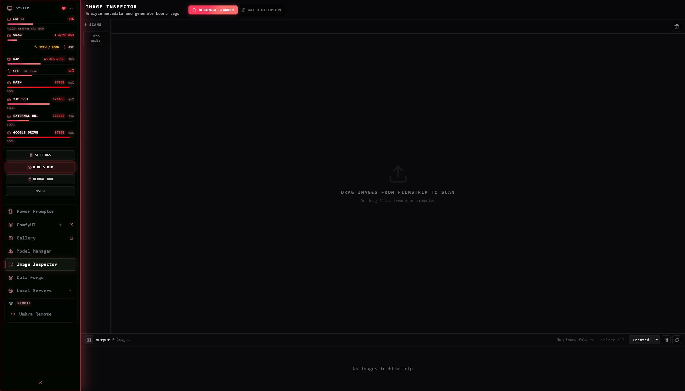](.github/screenshots/image-inspector.png) | [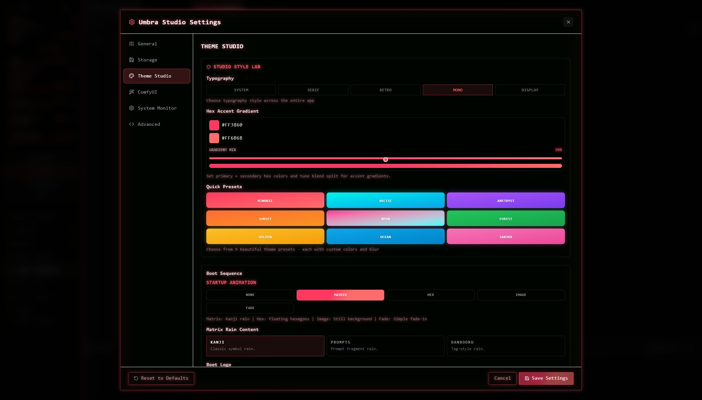](.github/screenshots/theme-studio.png) |

## User Release Model

Normal users should download a portable release zip, extract it, and run the
platform launcher. `Umbra-Studio-v<version>-Windows-x64-BAT.zip` starts from
`UmbraStudio.bat` using the bundled Bun runtime. Windows users do not need to
install Bun separately.

v0.22.0 is a one-time manual migration boundary for older Windows EXE builds.
Close Umbra Studio and its managed tools, extract the new BAT package, then move
only the old `User` and `Tools` folders into the new `Umbra Studio` folder. Do
not copy the old `UmbraStudio.exe`. Once migrated, Umbra Setup > Updates can install
future BAT releases normally while preserving `User` and `Tools`.

Linux releases start from `start-umbra.sh`. Users should not need to clone the
repository or install Bun.

The portable app bundles the Bun runtime under:

```text
Runtime/Bun/<platform>/
```

Managed tools and optional model packs are installed from inside Umbra or with the
release's helper scripts. GPU drivers and compatible generation model files remain
the user's responsibility.

When a managed Python tool is installed, Umbra can bootstrap its private Python
3.11 runtime into `Runtime/Python311`; users do not need to place Python inside
the application folder manually. The initial GitHub core archive keeps that
download out of the release asset and creates it on demand.

### Standalone Setup

Umbra Studio opens directly into the app. Setup is an optional independent
utility and never appears during browser refreshes, Umbra Remote login, or
normal startup.

Run the setup utility from the extracted application root:

Windows:

```bat
UmbraSetup.bat
```

Linux:

```bash
chmod +x umbra-setup.sh
./umbra-setup.sh
```

The utility uses the bundled Bun runtime and serves one local-only Setup app
(default port `8214`; in-app tool shortcuts can allocate a free local port).
**Guided setup** saves your progress and follows this order:

1. Choose and save English, Japanese, Simplified Chinese, Korean, or German.
   The guided instructions change immediately to the selected language.
2. Install managed ComfyUI, including its Python and CUDA/PyTorch environment.
3. Install AI Toolkit if you want to train models, or skip it.
4. Install custom nodes separately from model downloads.
5. Review and install support models. Optional manual models show their original
   download link and the exact destination folder.
6. Choose one generation family, install its prerequisites, and select a compatible
   checkpoint. Some packs include generation weights; prerequisite-only packs
   require a separate checkpoint from Umbra’s Model Manager. Additional families
   and feature models can be installed later through **Models**.
7. Verify installed requirements, nodes, model checksums, and checkpoint integrity.
   This check does not generate an image. Launch ComfyUI through Umbra afterwards;
   installation verification does not qualify GPU execution or image quality.

Existing valid model files are retained, supported partial downloads resume, and
only one installation or application update runs at a time. **Tools** retains
ComfyUI and AI Toolkit repairs, CUDA/PyTorch updates, custom nodes, SageAttention,
and ComfyUI version switching. **Models** retains optional Data Forge packs and
model-family downloads. **Updates** lists newer portable releases and shows a
progress bar, transferred bytes, and installation stages. Reopen Setup after an
application update before performing further maintenance.

The unified app preserves `User/` and `Tools/` during updates and does not migrate
files between versioned folders. Language can also be changed later under
**Settings > General > Language**.

Windows and Linux release packages include FFmpeg and ffprobe in
`Runtime/FFmpeg/<platform>`. Fresh installs and app updates receive the pair
automatically; no separate FFmpeg download or system PATH setup is required.
The source-built GPL-3.0-or-later executables include complete corresponding source archives, the exact build script, licenses, configuration and codec smoke-test evidence,
and build configuration beside the binaries.

Releases also include a portable CPU Python 3.11 helper environment with pandas,
NumPy, Pillow, ONNX Runtime, Hugging Face Hub, safetensors and psutil under
`Runtime/PythonHelpers/bundled/<platform>`. WD Tagger dependencies work without a
system Python or ComfyUI install. **Tagger model weights are not bundled**;
download the desired models through **Umbra Setup > Models**. PyTorch,
Transformers, PixAI and natural-language captioning remain separate managed
installations. Setup shows bundled library verification separately
from model and managed-tool readiness. Existing helper venvs are preserved by
app updates, and explicit `UMBRA_PYTHON` overrides keep priority.

For video thumbnail or metadata errors, open **Umbra Setup > Tools**, then select **Install / repair media tools**.
Umbra verifies FFmpeg and ffprobe separately. When needed, it downloads a
checksum-pinned portable pair into `Tools/FFmpeg` (about 184 MiB on Windows,
143 MiB on Linux). Repair tools retain their upstream license notices.
Linux extraction requires `tar` and `xz-utils` or equivalents. Existing working
tools are verified without a download. The repair preserves ComfyUI, user data,
and the system PATH. Gallery also finds FFmpeg in this installation's ComfyUI
`imageio_ffmpeg` environment. Explicit `FFMPEG_PATH` / `FFPROBE_PATH` overrides
take priority, followed by managed tools, the release's bundled pair,
bundled imageio FFmpeg, and PATH.

### First Run: Data Forge Caption Models

Data Forge uses a separate caption-model pack of more than 6 GB. Full portable
builds may already include it. GitHub core packages keep these weights out of
the main download; after extracting Umbra Studio, install them from the app
folder with the helper for your platform:

Windows:

```bat
UmbraSetup.bat --tab models --pack data-forge
```

Linux:

```bash
./umbra-setup.sh --tab models --pack data-forge
```

Keep Setup open until installation completes. The
installer verifies every pinned file and places the
models under:

```text
User/Models/WaifuTagger/
User/Models/DataForgeCaption/
```

Users running directly from a repository checkout can install the same pinned
model pack with:

```bash
bun run models:waifu:download
bun run models:caption:download
```

Restart Umbra after installation if Data Forge was already open. Arbitrary
caption models are not currently auto-discovered; manually supplied files must
match one of the supported model folders and file layouts in
`defaults/DataForge/model-manifest.json`.

### First Run: Umbra UI Support Models

Umbra installs the permissively licensed Umbra UI core support pack when it
sets up managed ComfyUI. The approximately 566 MB pack contains every
default-enabled detailer detector: person, face, and hands, plus SAM ViT-B mask refinement,
Real-ESRGAN x4plus upscaling, and RIFE 4.26 frame interpolation. Generation
checkpoints, LoRAs, VAEs, text encoders, ControlNet weights, and video models
remain user-selected downloads.

The same installer can be run or repaired manually from a portable package:

Windows:

```bat
UmbraSetup.bat --tab models --pack support
```

Linux:

```bash
./umbra-setup.sh --tab models --pack support
```

Source checkouts can use:

```bash
bun run models:umbra-ui:download
```

Canvas Control and Reference models are opt-in because several are large or
use model-specific non-commercial licenses. Run the main Umbra UI model
installer and choose only the Canvas resources for the pipelines you use:

```bat
UmbraSetup.bat --tab models
```

```bash
./umbra-setup.sh --tab models
```

The model-family list includes Anima, Qwen Image, and Z-Image Canvas controls,
plus SDXL IP-Adapter and FLUX.1 Redux reference conditioning. The menu shows
the exact download size and identifies non-commercial model terms before a
user confirms the selection.

Every automatic file is fetched from an immutable model revision and checked
by size and SHA-256 using the Umbra UI manifests. The eye
detailer remains saved as an optional disabled stage because `Eyes.pt` has
source-specific CivitAI permissions. Users who provide that detector can turn
the stage on. The listed anime upscalers likewise stay optional and
user-installed.

### Optional: Image Model Prerequisites

Umbra does not bundle large VAEs and text encoders in the release archives.
Use Umbra Setup to install only the resources
for the model families you actually use. Some profiles include generation
weights; review the selected files. Each verified file goes straight into its
correct `Tools/ComfyUI/models/` subfolder.

Windows:

```bat
UmbraSetup.bat --tab models
```

Windows and Linux packages no longer include separate model-download shortcuts.
Use **Umbra Setup > Models** for recommendations, family resources, and verification.

Linux:

```bash
./umbra-setup.sh --tab models
```

The menu covers Anima, FLUX.1, FLUX.2, Qwen Image, Krea 2, ERNIE Image,
Z-Image, Chroma 1, Ideogram 4, and the shared OmniGen 2/Ovis AE VAE. It also
explains when a model family such as HiDream-O1 or checkpoint-based SD/SDXL
needs no standalone prerequisite files. Use `--list` to review the menu,
`--family anima` to run a family non-interactively, or `--check` to verify a
previous selection without downloading.
Use `--test-downloads` to validate the selected remote files with tiny ranged
requests without downloading the model weights.

During a download, press `Q` or `Ctrl+C` to cancel. Umbra deletes the incomplete
file completely; a later run starts that file again from byte zero. Existing
files that already match both the pinned size and SHA-256 are retained.

Source checkouts can run the same helper with:

```bash
bun scripts/download-umbra-model-requirements.mjs
```

AI Toolkit is optional and currently requires Git plus Node.js 20 or newer for
its upstream web UI build. Umbra manages its checkout and Python virtual
environment after those host prerequisites are available.

Linux managed-tool installs also require the standard Python build headers and
compiler toolchain because some ComfyUI custom-node dependencies do not publish
wheels for every Python/platform combination. On Debian or Ubuntu, install them
with `sudo apt install python3-dev build-essential libgl1 libglib2.0-0`.

Data Forge includes two captioning paths: four pinned SmilingWolf WD Tagger v3
ONNX models for structured booru tags, and a pinned Qwen2-VL 2B caption model
for natural-language captions. Local portable builds bundle this model pack by
default. Repository checkouts and GitHub core packages keep the model weights
out of Git and install exact revisions from
`defaults/DataForge/model-manifest.json` using the steps above.

Python helpers use virtual environments:

- Managed tools such as ComfyUI use tool-local venvs, for example `Tools/ComfyUI/venv/`.
- Umbra helper scripts such as WD tagger use `Runtime/PythonHelpers/venv/`.

## Development Quick Start

Prerequisites for source development:

- Bun
- Git
- Python for ComfyUI/tool runtimes
- Linux: Python development headers and a C/C++ compiler toolchain
- GPU drivers and model files for local generation workflows

From a source checkout:

```powershell
cd umbra-studio
```

Install source dependencies:

```powershell
bun install
```

Run the normal full development server:

```powershell
bun run dev:fullstack
```

Open:

```text
http://localhost:8212
```

Useful development commands:

```powershell
bun run dev:backend
bun run build:frontend
bun run webapp:dev
```

`dev:fullstack` is the preferred day-to-day command. `webapp:dev` runs through
the portable web launcher path and is useful when testing launcher/runtime
behavior.

## Tool Install / Update Entry Points

Linux/macOS:

```bash
./install-tools.sh all
```

Windows:

```bat
install-tools.bat all
```

Single-tool examples:

```bash
./install-tools.sh comfyui
./install-tools.sh comfy-nodes
./install-tools.sh python-helpers
```

AI Toolkit and ComfyUI are managed installations stored under `Tools/`; their
large upstream checkouts and virtual environments are not committed to this
repository. Data Forge model weights are pinned by the included downloader
scripts. GitHub portable packages include **Umbra Setup > Models** so users
can install those weights after
extracting the core package. Downloads are checked against the byte sizes and
SHA-256 values in the bundled manifest before installation completes.

Managed ComfyUI custom nodes intentionally track each project's latest
upstream default branch. Umbra does not pin custom-node commits; setup and
update actions pull current upstream changes. Downloadable support-model files
are pinned separately so their integrity and destination remain deterministic.
LTX Storyboard mode uses Umbra Director, maintained inside
[Umbra-Nodes](https://github.com/Nocturne-Ai-Labs/Umbra-Nodes). Umbra owns the
editor, persisted storyboard contract, temporal prompt scheduler, queue
integration, and workflow compiler. Guide images continue through ComfyUI's
native LTX guide nodes.

## Publish Portable Build

Published updates default to a patch version bump. A no-bump build is reserved
for local testing or an in-place local update when the user explicitly requests
it. The commands below cover local builds; tagged releases use the GitHub
Actions workflow.

Future agents should confirm any details not already supplied:

- target platform
- target publish folder for local builds

The version is bumped once before multi-platform packaging. Tagged GitHub
Actions builds use the no-bump packaging commands because the source version is
already final.

GitHub releases are built by `.github/workflows/release.yml`.

Windows portable folder builds:

No-bump update of the current portable folder:

```powershell
bun run webapp:update-folder:no-bump
```

The explicit BAT alias remains available for older developer instructions:

```powershell
bun run webapp:update-folder:bat:no-bump
```

Versioned publish:

```powershell
bun run webapp:update-folder
```

Linux portable folder builds:

```bash
bun run linux:update-folder:no-bump
bun run linux:update-folder
```

Default local output in the current Windows development scripts:

```text
../Apps/Umbra Studio/
```

## Runtime Paths

Portable builds keep runtime data in the stable application root:

```text
Umbra Studio/
```

Important runtime folders:

- `Tools`
- `User`

The clean repository keeps an empty `Tools/` folder and a placeholder-only
`User/` directory tree so developers can see the runtime layout immediately.
Installed tools, model weights, configuration, datasets, and generated media
remain untracked. The old top-level `Models/` path is not used; Umbra-owned
models live under `User/Models`, while ComfyUI owns `Tools/ComfyUI/models`.

Do not wipe the existing application root during publishing, updating, or
cleanup. It can contain model merges, generated outputs, installed tools, and
other runtime artifacts that are not recoverable from the source tree. Fresh
release jobs use an explicit temporary `Umbra Studio` package root; local
publishes preserve `User/` and `Tools/`.

Tools are intentionally **not** stored in `resources/app`.

## Documentation

- System and feature requirements: `REQUIREMENTS.md`
- Root distributable credits: `Credits.md`
- License: `LICENSE`
- Attribution notice for public forks / redistributed builds: `NOTICE`

Internal planning and agent notes are deliberately excluded from the public
source package. User-facing help is maintained inside Umbra Studio.

## Ownership

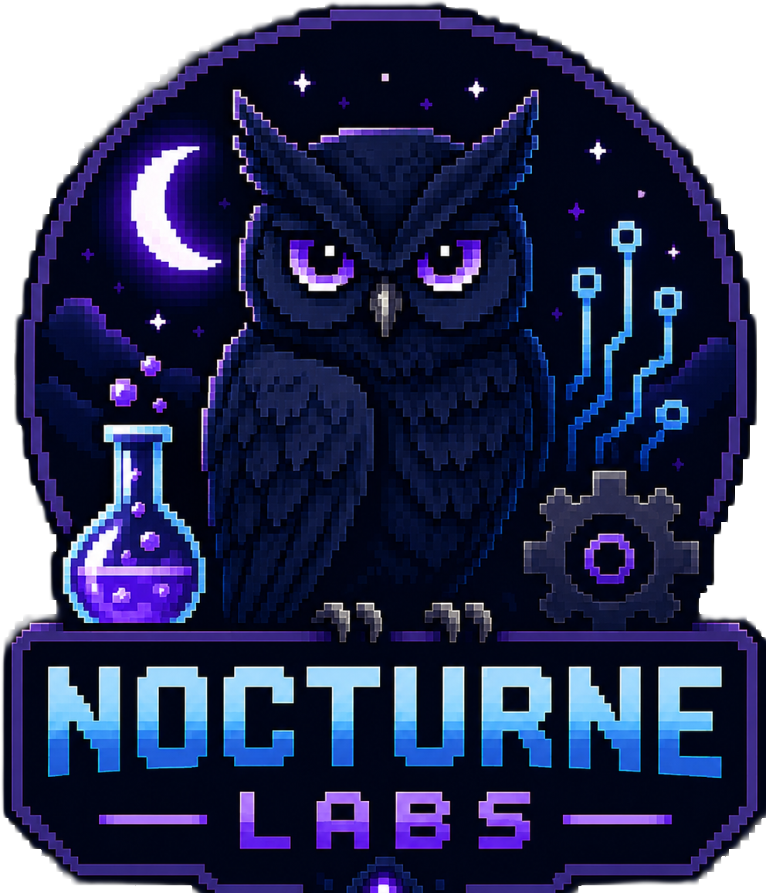

Umbra Studio is owned and published by **Nocturne AI Labs** and developed by
**Minokai**. The canonical repository is
[Nocturne-Ai-Labs/Umbra-Studio](https://github.com/Nocturne-Ai-Labs/Umbra-Studio).
